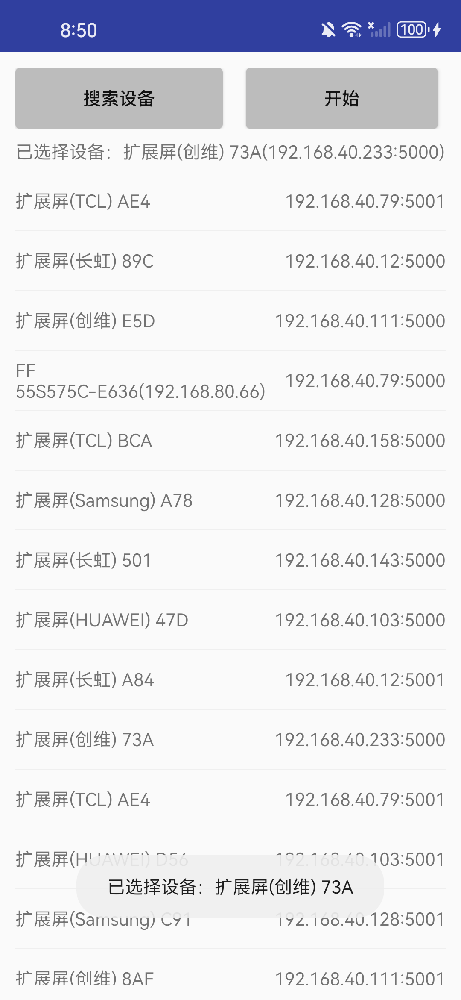

## 功能特点：
 - 通过WebRTC实现点对点视频推流
 - 翻转摄像头
 - 镜像

## 演示截图：
<p align="center">
  
  
</p>

<p align="center">
  
</p>

## 使用方法：
1. 电视端安装快应用 `huanCapture_general_2.9.1532_20250428181803_release.apk`，并打开；
2. 启动本项目；
3. 点击`搜索设备`按钮；
4. 选择对应设备；
5. 点击`开始`按钮，进入推流页面；
6. 点击`开始推流`按钮；

## 集成流程：
1. 在HuanCapture/build.gradle添加：
   ```java
   allprojects {
    repositories {
        maven { url 'https://nexus.extscreen.com/repository/maven-public/' }
    }
   }
2. 在HuanCapture/app/build.gradle添加：
   ```java
   dependencies {
     implementation 'io.github.100mslive:webrtc:m94-4606'   //webrtc引入
     implementation 'com.extscreen.sdk:messenger-client:1.1.4'   //超级投屏引入
   }

⚠️超级投屏使用方式请详见：[超级投屏](https://github.com/hanliang-tech/es-cast-client-android) 

⚠️电视端快应用apk详见：[电视端快应用](https://github.com/chengyeah/HuanCapture/blob/main/tvapp/huanCapture_general_2.9.1532_20250428181803_release.apk)
  
